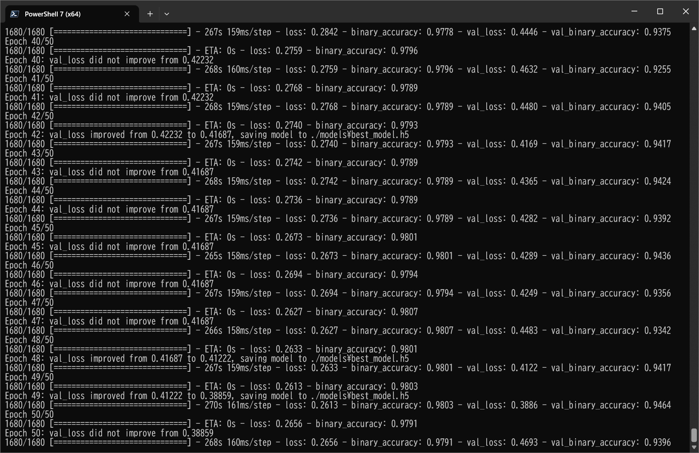
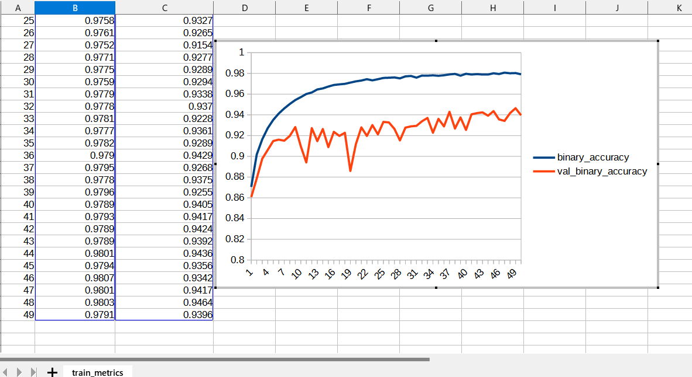
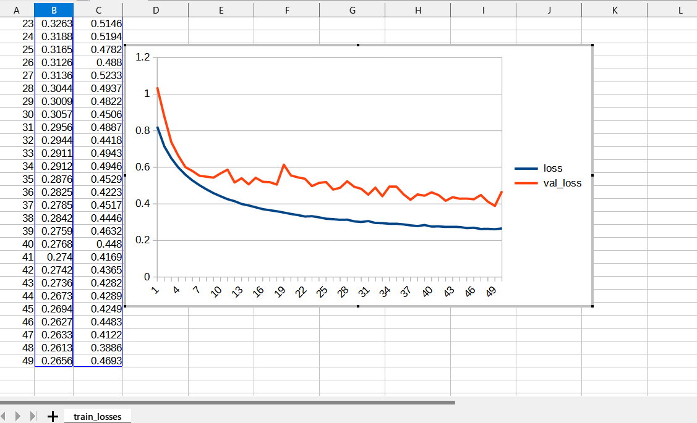
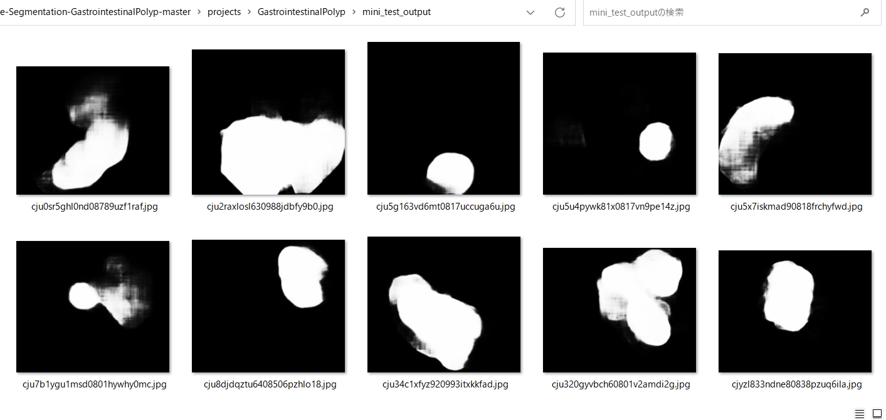
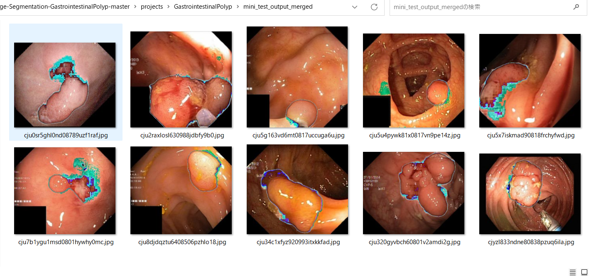

<h2>
TensorflowUNet3Plus-Segmentation-Gastrointestinal-Polyp (Updated: 2023/06/30)
</h2>
This is an experimental project to detect <b>Gastrointestinal-Polyp</b> 
by using <a href="./TensorflowUNet3Plus.py">TensorflowUNet3Plus</a> Model,
which is a slightly modified version based on <b>unet3plus.py</b> in the following repository. 

<b>UNet 3+: A Full-Scale Connected UNet for Medical Image Segmentation</b> 
<pre>
https://github.com/hamidriasat/UNet-3-Plus/blob/unet3p_lits/models/unet3plus.py
</pre>
On UNet 3+, please refer to the following paper: 
<b>3. UNet 3+: A Full-Scale Connected UNet for Medical Image Segmentation</b> 
<pre>
https://arxiv.org/ftp/arxiv/papers/2004/2004.08790.pdf
</pre>

The image dataset used here has been taken from the following web site.

<pre>
Kvasir-SEG Data (Polyp segmentation & detection)
https://www.kaggle.com/datasets/debeshjha1/kvasirseg
</pre>

See also: 
<a href="https://github.com/atlan-antillia/Image-Segmentation-Gastrointestinal-Polyp">Image-Segmentation-Gastrointestinal-Polyp</a>
 

<h2>
2 Prepare dataset
</h2>

<h3>
2.1 Download master dataset
</h3>
 Please download the original dataset from the following link 
<pre>
Kvasir-SEG Data (Polyp segmentation & detection)
https://www.kaggle.com/datasets/debeshjha1/kvasirseg
</pre>
<b>Kvasir-SEG</b> dataset has the following folder structure. 
<pre>
Kvasir-SEG
├─annotated_images
├─bbox
├─images
└─masks
</pre>

<h3>
2.2 Create master dataset
</h3>
We have split <b>images</b> and <b>masks</b> dataset in Kvasir-SEG to <b>test</b>, <b>train</b> and <b>valid</b> dataset 
by using Python <a href="./projects/GastrointestinalPolyp/generator/create_master_256x256.py">create_master_256x256.py</a> script,
by which we have also resized all images and masks files in <b>train</b> and <b>valid</b> to be 256x256 and 
applied some rotation and flip operations to the resized images to augment those dataset.    
<pre>
GastrointestinalPolyp
├─test
│  ├─images
│  └─masks
├─train
│  ├─images
│  └─masks
└─valid
    ├─images
    └─masks
</pre>
<b>Augmented image samples: GastrointestinalPolyp/train/images</b> 
 
<b>Augmented mask samples: GastrointestinalPolyp/train/mask</b> 
 

<h3>
3 TensorflowUNet3Plus class
</h3>
We have defined <a href="./TensorflowUNet3Plus.py">TensorflowUNet3Plus</a> class as a subclass of <a href="./TensorflowUNet.py">TensorflowUNet</a> class. A <b>create</b> method in that class has been taken from 
<a href="https://github.com/hamidriasat/UNet-3-Plus/blob/unet3p_lits/models/unet3plus.py">unet3plus.py</a>
 and 
<a href="https://github.com/hamidriasat/UNet-3-Plus/blob/unet3p_lits/models/unet3plus_utils.py">unet3plus_utils.py</a>
 
in the following repository: 
<a href="https://github.com/hamidriasat/UNet-3-Plus"><b>UNet 3+: A Full-Scale Connected UNet for Medical Image Segmentation</b>
</a> 

<h3>3.1 Dropout to conv_block</h3>
We have added <b>Dropout</b> layers to the original <b>conv_block</b> function as shown below. 
<pre>
  #The following method has been taken from 
  # https://github.com/hamidriasat/UNet-3-Plus/blob/unet3p_lits/models/unet3plus_utils.py
 
  def conv_block(self, x, kernels, kernel_size=(3, 3), strides=(1, 1), padding='same',
               is_bn=True, is_relu=True, n=2):
    """ Custom function for conv2d:
        Apply  3*3 convolutions with BN and relu.
    """

    for i in range(1, n + 1):
        x = k.layers.Conv2D(filters=kernels, kernel_size=kernel_size,
                            padding=padding, strides=strides,
                            kernel_regularizer=tf.keras.regularizers.l2(1e-4),
                            kernel_initializer=k.initializers.he_normal(seed=5))(x)
        #2023/06/28
        #<experiment>
        x = Dropout(self.dropout_rate * i)(x)
        #</experiment>

        if is_bn:
            x = k.layers.BatchNormalization()(x)
        if is_relu:
            x = k.activations.relu(x)

    return x
</pre>

<h3>3.2 Filter sizes</h3>
We have also modified the original filters 
<pre>
    """ UNet3+ base model """
    filters = [64, 128, 256, 512, 1024]
</pre>
in 
<a href="https://github.com/hamidriasat/UNet-3-Plus/blob/unet3p_lits/models/unet3plus.py">unet3plus.py</a>
 to be less size filters as shown below. In this case, a default base_filters is 16, which helps
to avoid memory allocation error. 
<pre>
  def create(self, num_classes, image_height, image_width, image_channels,
            base_filters = 16, num_layers = 5):
    print("=== TensorflowUNet3Plus  create ...")
    # num_layers is not unsed
    self.dropout_rate = self.config.get(MODEL, "dropout_rate")
    print("=== dropout_rate {}".format(self.dropout_rate))
    output_channels = 1
    #input_shape, output_channels
    input_shape = (image_width, image_height, image_channels)
    num_filters = 5
    """ UNet3+ base model """
    #filters = [64, 128, 256, 512, 1024]
    filters = []
    for i in range(num_filters):
      filters.append(base_filters * (2**i))
    print("--- filters {}".format(filters))
   
</pre>
 

<h2>
4 Train TensorflowUNet3Plus Model
</h2>
 We have trained Gastrointestinal Polyp <a href="./TensorflowUNet3Plus.py">TensorflowUNet3Plus</a> Model by using the following
 <b>train_eval_infer.config</b> file.  
Please move to <b>./projects/GastrointestinalPolyp</b> directory, and run the following train bat file. 
<pre>
>1.train.bat
</pre>
, which simply runs the following command. 
<pre>
>python ../../TensorflowUNet3PlusTrainer.py train_eval_infer.config
</pre>
, where train_eval_infer.config is the following.
<pre>
; train_eval_infer.config
; 2023/6/28 antillia.com

[model]
image_width    = 256
image_height   = 256
image_channels = 3
num_classes    = 1
base_filters   = 16
dropout_rate   = 0.06
learning_rate  = 0.0001
clipvalue      = 0.2
loss           = "bce_iou_loss"
metrics        = ["binary_accuracy"]
show_summary   = False

[train]
epochs        = 50
batch_size    = 2
patience      = 10
metrics       = ["binary_accuracy", "val_binary_accuracy"]
model_dir     = "./models"
eval_dir      = "./eval"

image_datapath = "./GastrointestinalPolyp/train/images/"
mask_datapath  = "./GastrointestinalPolyp/train/masks/"

[eval]
image_datapath = "./GastrointestinalPolyp/test/images/"
mask_datapath  = "./GastrointestinalPolyp/test/masks/"

[infer] 
images_dir    = "./mini_test" 
output_dir    = "./mini_test_output"
merged_dir    = "./mini_test_output_merged"

[mask]
blur      = True
binarize  = True
threshold = 60
</pre>

Since <pre>loss = "bce_iou_loss"</pre> and <pre>metrics = ["binary_accuracy"] </pre> are specified 
in <b>train_eval_infer.config</b> file,
<b>bce_iou_loss</b> and <b>binary_accuracy</b> functions are used to compile our model as shown below.
<pre>
    # Read a loss function name from a config file, and eval it.
    # loss = "bce_iou_loss"
    self.loss  = eval(self.config.get(MODEL, "loss"))

    # Read a list of metrics function names from a config file, and eval each of the list,
    # metrics = ["binary_accuracy"]
    metrics  = self.config.get(MODEL, "metrics")
    self.metrics = []
    for metric in metrics:
      self.metrics.append(eval(metric))
    self.model.compile(optimizer = self.optimizer, loss= self.loss, metrics = self.metrics)
</pre>
You can also specify other loss and metrics functions in the config file. 
Example: basnet_hybrid_loss(https://arxiv.org/pdf/2101.04704.pdf) 
<pre>
loss         = "basnet_hybrid_loss"
metrics      = ["dice_coef", "sensitivity", "specificity"]
</pre>
On detail of these functions, please refer to <a href="./losses.py">losses.py</a> , and 
<a href="https://github.com/shruti-jadon/Semantic-Segmentation-Loss-Functions/tree/master">Semantic-Segmentation-Loss-Functions (SemSegLoss)</a>.

We have also used Python <a href="./ImageMaskDataset.py">ImageMaskDataset.py</a> script to create
train and test dataset from the <b>GastrointestinalPolyp</b> dataset specified by
<b>image_datapath</b> and <b>mask_datapath </b> parameters in the configratration file. 

 
 
The <b>val_accuracy</b> is very high as shown below from the beginning of the training. 
<b>Train accuracies line graph</b>: 
 

 
The val_loss is also very low as shown below from the beginning of the training. 
<b>Train losses line graph</b>: 
 

<h2>
5 Inference 
</h2>
We have also tried to infer the segmented region for <b>mini_test</b> dataset, which is a very small dataset including only 
ten images extracted from <b>test</b> dataset,
 by using our Pretrained  GastrointestinalPolyp Model. 
<pre>
>3.infer.bat
</pre>
, which simply runs the following command. 
<pre>
>python ../../TensorflowUNet3PlusInferencer.py train_eval_infer.config
</pre>

<b>Input images (mini_test) </b> 
 
 

<b>Ground truth mask (mini_test_mask) </b> 
 
 

<b>Inferred images (mini_test_output)</b> 
Some white polyp regions in the original images of the mini_test dataset above have been detected as shown below.
 
 
<b>Merged inferred images blended with the orignal images and inferred images</b> 
  

 
<!--
-->

<h3>
References
</h3>

<b>1. Kvasir-SEG Data (Polyp segmentation & detection)</b> 
<pre>
https://www.kaggle.com/datasets/debeshjha1/kvasirseg
</pre>

<b>2. Kvasir-SEG: A Segmented Polyp Dataset</b> 
Debesh Jha, Pia H. Smedsrud, Michael A. Riegler, P˚al Halvorsen, 
Thomas de Lange, Dag Johansen, and H˚avard D. Johansen 
<pre>
https://arxiv.org/pdf/1911.07069v1.pdf
</pre>

<b>3. UNet 3+: A Full-Scale Connected UNet for Medical Image Segmentation</b> 
Huimin Huang, Lanfen Lin, Ruofeng Tong, Hongjie Hu, Qiaowei Zhang, Yutaro Iwamoto, Xianhua Han, Yen-Wei Chen, Jian Wu
 
<pre>
https://arxiv.org/ftp/arxiv/papers/2004/2004.08790.pdf
</pre>

<b>4. UNet 3+: A Full-Scale Connected UNet for Medical Image Segmentation</b> 
<pre>
https://github.com/hamidriasat/UNet-3-Plus/blob/unet3p_lits/models/unet3plus.py
</pre>

